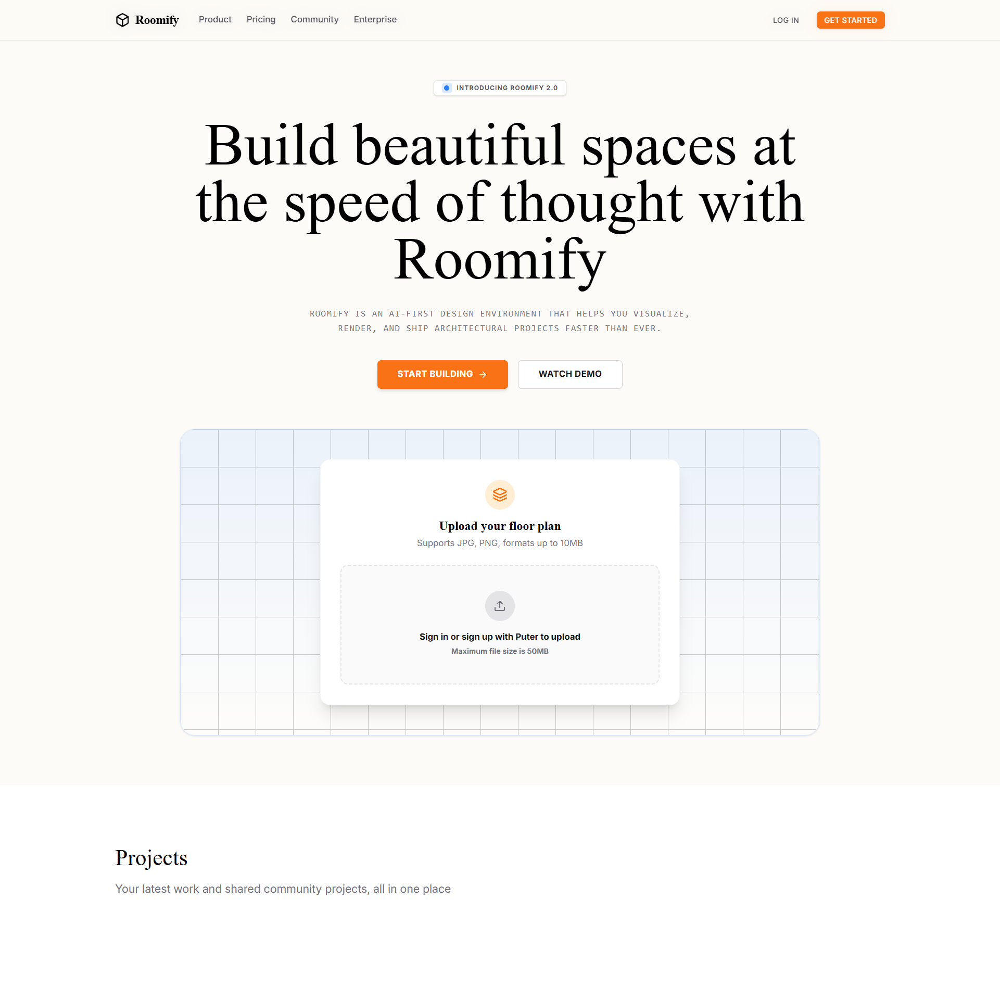
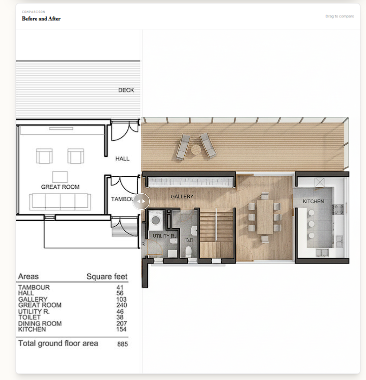
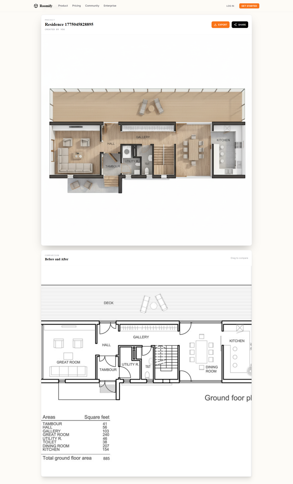
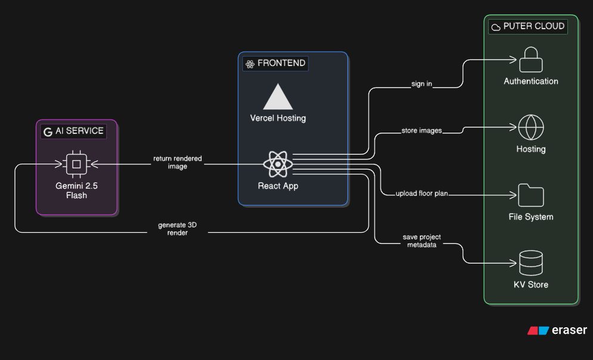

<div align="center">

# Roomify


**AI-Powered Architectural Visualization Platform - Transform 2D floor plans into photorealistic 3D renders in seconds**



[🚀 Live Demo](https://roomify-virid-three.vercel.app/) • [📖 Features](#key-features) • [🛠️ Tech Stack](#technology-stack) • [🚀 Getting Started](#installation--getting-started) • [🏗️ Architecture](#architecture)

</div>

---

## What is Roomify?

Roomify is an **AI-first design environment** that helps architects, interior designers, and homeowners visualize, render, and transform their 2D floor plans into photorealistic 3D visualizations at the speed of thought.

### **The Problem:**

Traditional architectural visualization suffers from significant bottlenecks:

- ⏱️ **Time-Consuming** - Manual 3D modeling takes days or weeks
- 💰 **Expensive** - Professional rendering software costs thousands annually
- 🔧 **Technical Barrier** - Requires expertise in Blender, SketchUp, or AutoCAD
- 🔄 **Iterative Pain** - Making design changes means starting over

### **The Solution:**

Roomify leverages cutting-edge AI powered by **Google Gemini 2.5 Flash** to:

- ⚡ **Instant Rendering** - Convert floor plans to 3D in seconds, not days
- 💵 **Cost-Effective** - No expensive software licenses required
- 🎯 **Accessible** - Anyone can upload a floor plan and get professional results
- 🔁 **Iterative-Friendly** - Make changes instantly with zero overhead





---

## Key Features

### 🤖 AI-Powered Rendering

- **Instant 2D-to-3D Conversion** - Upload a floor plan and receive a photorealistic render in seconds
- **Smart Geometry Detection** - AI accurately interprets walls, doors, windows, and architectural elements
- **Furniture Mapping** - Automatically transforms furniture icons into realistic 3D representations (beds, sofas, tables, kitchen fixtures)

### 🎨 User Experience

- **Before/After Comparison** - Interactive slider to compare original floor plans with rendered visualizations
- **Real-Time Processing** - Live progress indicators during AI rendering
- **Project Gallery** - Browse and manage all your saved projects



### ☁️ Cloud Integration

- **Secure Cloud Storage** - Projects saved and synced via Puter.js cloud infrastructure
- **User Authentication** - Sign in to access personal projects across devices
- **Public Sharing** - Share renders with clients via public links

### 💾 Data Management

- **Image Export** - Download high-resolution renders (1024×1024 PNG)
- **Project Persistence** - All projects saved with source and rendered images
- **Multi-Format Support** - Supports JPG, PNG formats up to 10MB

---

## Technology Stack

### Frontend

| Technology | Purpose |
|------------|---------|
| React 19 | UI Framework |
| React Router 7 | Routing & Data Loading |
| TypeScript | Type Safety |
| Tailwind CSS 4 | Styling |
| Vite 7 | Build Tool |
| Lucide React | Icon Library |
| React Compare Slider | Before/After UI Component |

### Backend & External Services

| Technology | Purpose |
|------------|---------|
| Puter.js | Cloud Backend (Auth, Storage, KV, Workers) |
| Google Gemini 2.5 Flash | AI Image Generation |
| Docker | Containerization |
| Puter Workers | Serverless API Handlers |

### Development Tools

| Technology | Purpose |
|------------|---------|
| TypeScript | Language |
| ESLint | Code Linting |
| Git | Version Control |
| GitHub Actions | CI/CD Pipeline |

---

## Project Structure

```
roomify/
├── .dockerignore           # Docker build exclusions
├── .gitignore              # Git ignore patterns
├── Dockerfile               # Docker container definition
├── package.json             # Dependencies & scripts
├── package-lock.json        # Locked dependency versions
├── tsconfig.json            # TypeScript configuration
├── vite.config.ts           # Vite bundler configuration
├── react-router.config.ts   # React Router configuration
├── type.d.ts                # Global TypeScript type definitions
│
├── app/                     # Main application directory
│   ├── app.css              # Global styles (Tailwind imports)
│   ├── root.tsx             # Root component & routing setup
│   ├── routes.ts            # Route definitions
│   │
│   ├── routes/              # Page components
│   │   ├── home.tsx                    # Landing/home page
│   │   └── visualizer.$id.tsx           # Project visualizer page
│   │
│   └── components/          # Reusable UI components
│       ├── Navbar.tsx       # Navigation bar
│       ├── Upload.tsx       # File upload component
│       └── ui/              # Base UI components
│           └── Button.tsx   # Button component
│
├── lib/                     # Business logic & utilities
│   ├── ai.action.ts        # AI generation logic (Gemini)
│   ├── constants.ts        # App constants & prompts
│   ├── puter.action.ts     # Puter.js auth & project actions
│   ├── puter.hosting.ts    # Image hosting utilities
│   ├── puter.worker.js      # Worker script for Puter
│   └── utils.ts             # Helper functions
│
├── public/                  # Static assets
│   └── favicon.ico          # Site favicon
│
└── .vite/                   # Vite cache directory
```

---

## Architecture

### High-Level Architecture

```
┌─────────────────────────────────────────────────────────────────────────────┐
│                                   CLIENT                                    │
├─────────────────────────────────────────────────────────────────────────────┤
│                                                                             │
│  ┌─────────────┐     ┌─────────────┐     ┌─────────────┐                    │
│  │   Home      │     │ Visualizer  │     │   Upload    │                    │
│  │   Page      │     │   Page      │     │  Component  │                    │
│  └──────┬──────┘     └──────┬──────┘     └──────┬──────┘                    │
│         │                  │                  │                             │
│         └──────────────────┼──────────────────┘                             │
│                            │                                                │
│                    ┌───────▼───────┐                                        │
│                    │  React Router │                                        │
│                    │   (v7)        │                                        │
│                    └───────┬───────┘                                        │
│                            │                                                │
│         ┌──────────────────┼──────────────────┐                             │
│         │                  │                  │                             │
│  ┌──────▼──────┐    ┌──────▼──────┐    ┌──────▼──────┐                      │
│  │  Puter.js   │    │  AI Action  │    │   Storage   │                      │
│  │   Auth      │    │  (Gemini)   │    │  (Puter FS) │                      │
│  └──────┬──────┘    └──────┬──────┘    └──────┬──────┘                      │
│         │                  │                  │                             │
└─────────┼───────────────── ┼────────────────  ┼────────────────────────────┘
          │                 │                   │
          │     ┌───────────┴───────────┐       │
          │     │      Puter Cloud      │       │
          │     │  ┌─────────────────┐  │       │
          │     │  │   Authentication │ │       │
          │     │  │   (JWT/OAuth)    │ │       │
          │     │  └────────┬────────┘  │       │ 
          │     │           │           │       │
          │     │  ┌────────▼────────┐  │       │
          │     │  │  Key-Value      │  │       │
          │     │  │  Store (KV)     │  │       │
          │     │  └────────┬────────┘  │       │
          │     │           │           │       │
          │     │  ┌────────▼────────┐  │       │
          │     │  │  File System    │  │       │
          │     │  │  (Projects)     │  │       │
          │     │  └────────┬────────┘  │       │
          │     │           │           │       │
          │     │  ┌────────▼────────┐  │       │
          │     │  │  Hosting        │  │       │
          │     │  │  (Subdomains)   │  │       │
          │     │  └─────────────────┘  │       │
          │     └───────────────────────┘       │
          │                                     │
          │     ┌───────────────────────┐       │
          │     │     Google Gemini     │       │  
          │     │   2.5 Flash (AI)      │       │
          │     │   ┌─────────────────┐ │       │
          │     │   │  Image-to-Image │ │       │
          │     │   │  Generation     │ │       │
          │     │   └────────────────┘  │       │
          │     └───────────────────────┘       │
          │                                     │
          └────────────────────────────────  ───┘
```

### Data Flow Diagram

```
┌──────────────┐     ┌──────────────┐     ┌──────────────┐
│   User       │     │   Upload     │     │   AI         │
│   uploads    │────▶│   Floor      │────▶│   Processing│
│   floor plan │     │   Plan       │     │   (Gemini)   │
└──────────────┘     └──────────────┘     └──────┬───────┘
                                                 │
                                                 ▼
┌──────────────┐     ┌──────────────┐     ┌──────────────┐
│   Display    │     │   Save       │     │   Receive    │
│   Rendered   │◀────│   Project   │◀────│   Rendered   │
│   Image      │     │   (Puter FS) │     │   Image      │
└──────────────┘     └──────────────┘     └──────────────┘


STEP-BY-STEP FLOW:
═══════════════════════════════════════════════════════════════════════════

1. UPLOAD          2. PROCESS          3. GENERATE        4. SAVE
   ┌─────────┐       ┌─────────────┐      ┌───────────┐     ┌─────────┐
   │ Floor   │       │ Convert to  │      │ AI Model  │     │ Store   │
   │ Plan    │──────▶│ Base64      │─────▶│ Processes │────▶│ Images │
   │ (PNG/JPG)       │             │      │ Prompt    │     │ to FS   │
   └─────────┘       └─────────────┘      └───────────┘     └─────────┘
                                                 │
                                                 ▼
                                         5. DISPLAY
                                            ┌───────────┐
                                            │ Rendered  │
                                            │ Image     │
                                            │ Shown in  │
                                            │ UI        │
                                            └───────────┘
```

### Component Architecture

```
┌─────────────────────────────────────────────────────────────────┐
│                        React Router v7                          │
│  ┌────────────────────┐         ┌─────────────────────────────┐ │
│  │      / (Home)      │         │   /visualizer/:id           │ │
│  │  ┌──────────────┐  │         │  ┌───────────────────────┐ │  │
│  │  │   Navbar     │  │         │  │     VisualizerPage    │ │  │
│  │  └──────────────┘  │         │  │  ┌─────────────────┐  │ │  │
│  │  ┌──────────────┐  │         │  │  │  RenderArea     │  │ │  │
│  │  │   Upload     │──┼────────▶│  │  │  (AI Output)    │ │ │  │
│  │  │  Component   │  │         │  │  └─────────────────┘  │ │  │
│  │  └──────────────┘  │         │  │  ┌─────────────────┐  │ │  │
│  │  ┌──────────────┐  │         │  │  │  CompareSlider  │  │ │  │
│  │  │   Projects   │  │         │  │  │  (Before/After) │  │ │  │
│  │  │    Grid      │  │         │  │  └─────────────────┘  │ │  │
│  │  └──────────────┘  │         │  └───────────────────────┘ │  │
│  └────────────────────┘         └─────────────────────────────┘ │
└─────────────────────────────────────────────────────────────────┘
```

---

## Installation & Getting Started

### Prerequisites

Ensure you have the following installed on your system:

| Requirement | Version | Notes |
|-------------|---------|-------|
| Node.js | 18.x or higher | LTS recommended |
| npm | 9.x or higher | Comes with Node.js |
| Docker | 20.x or higher | Optional (for containerized deployment) |

```bash
# Verify installations
node --version    # v18.x.x or higher
npm --version     # 9.x.x or higher
docker --version  # Optional
```

### Clone the Repository

```bash
git clone https://github.com/aridepai17/ROOMIFY.git
cd roomify
```

### Install Dependencies

```bash
npm install
```

### Environment Configuration

Create a `.env` file in the project root with the following variables:

```env
# Puter.js Configuration
# Get your worker URL from Puter dashboard or self-host a worker
VITE_PUTER_WORKER_URL=https://your-worker-domain.puter.dev

# Optional: Override default Puter.js origin (rarely needed)
# VITE_PUTER_ORIGIN=https://puter.dev
```

> 📝 **Note:** The `VITE_PUTER_WORKER_URL` is required for project persistence. Without it, projects will not be saved to the cloud.

### Start Development Server

```bash
npm run dev
```

The application will be available at: **`http://localhost:5173`**

### Build for Production

```bash
# Create production build
npm run build

# Start production server
npm start
```

### Docker Deployment

```bash
# Build the Docker image
docker build -t roomify:latest .

# Run the container
docker run -p 3000:3000 roomify:latest
```

The containerized application can be deployed to:

- AWS ECS / Elastic Beanstalk
- Google Cloud Run
- Azure Container Apps
- Digital Ocean App Platform
- Fly.io
- Railway
- Render

---

## Usage Guide

### For End Users

1. **Navigate to the home page** - Visit `http://localhost:5173`
2. **Upload a floor plan** - Drag and drop or click to select a floor plan image (JPG/PNG, max 10MB)
3. **Wait for AI processing** - Watch the live progress indicator
4. **View your render** - See the photorealistic 3D visualization
5. **Compare results** - Use the before/after slider to see the transformation
6. **Export or share** - Download your render or share the link with clients

### For Developers

```typescript
// Authentication
import { signIn, signOut, getCurrentUser } from './lib/puter.action';

// Sign in with Puter
await signIn();
const user = await getCurrentUser();

// Project Management
import { createProject, getProjects, getProjectById } from './lib/puter.action';

// Create a new project
const project = await createProject({
  item: {
    id: 'project-123',
    name: 'My Residence',
    sourceImage: 'data:image/png;base64,...',
    renderedImage: 'data:image/png;base64,...',
    timestamp: Date.now()
  },
  visibility: 'private' // or 'public'
});

// List all projects
const allProjects = await getProjects();

// Get a specific project
const singleProject = await getProjectById({ id: 'project-123' });

// AI Generation
import { generate3DView } from './lib/ai.action';

// Generate 3D render from floor plan
const result = await generate3DView({
  sourceImage: 'data:image/png;base64,...'
});

// Result contains:
// result.renderedImage - The generated 3D render (base64)
// result.renderedPath - Path to stored render (if hosted)
```

---

## API Reference

### Authentication Actions

| Action | Parameters | Description |
|--------|------------|-------------|
| `signIn` | None | Initiates Puter.js OAuth sign-in flow |
| `signOut` | None | Signs out the current user |
| `getCurrentUser` | None | Returns current user object or null |

### Project Actions

| Action | Parameters | Description |
|--------|------------|-------------|
| `createProject` | `{ item: DesignItem, visibility: 'private' \| 'public' }` | Saves a new project with source and rendered images |
| `getProjects` | None | Retrieves all projects for the authenticated user |
| `getProjectById` | `{ id: string }` | Retrieves a specific project by ID |

### AI Actions

| Action | Parameters | Description |
|--------|------------|-------------|
| `generate3DView` | `{ sourceImage: string }` | Converts floor plan to 3D render using Gemini AI |

### Hosting Utilities

| Function | Parameters | Description |
|----------|------------|-------------|
| `getOrCreateHostingConfig` | None | Gets or creates a Puter hosting subdomain |
| `uploadImageToHosting` | `{ hosting, url, projectId, label }` | Uploads an image to Puter hosting |

---

## Security Features

- **OAuth Authentication** - User identity managed via Puter.js secure OAuth flow
- **JWT Token Management** - Authentication tokens handled securely by Puter.js
- **Client-Side Processing** - Floor plan images processed locally before upload
- **KV Store Encryption** - Project metadata stored in Puter's encrypted key-value store
- **File System Isolation** - Each user's files isolated in their private directory

---

## Contributing

We welcome contributions! Please follow these steps:

### 1. Fork the Repository

Click the "Fork" button on GitHub or run:

```bash
git clone https://github.com/aridepai17/ROOMIFY.git
cd roomify
```

### 2. Create a Feature Branch

```bash
git checkout -b feature/your-feature-name
# or
git checkout -b fix/bug-description
```

### 3. Make Your Changes

- Follow the existing code style and conventions
- Add tests for new functionality
- Update documentation as needed

### 4. Commit Your Changes

```bash
git add .
git commit -m 'Add: Describe your feature or fix'
```

### 5. Push to GitHub

```bash
git push origin feature/your-feature-name
```

### 6. Open a Pull Request

1. Navigate to the [original repository](https://github.com/aridepai17/ROOMIFY)
2. Click **"New Pull Request"**
3. Fill in the template with details about your changes
4. Submit and wait for review

> 💡 **Pro Tip:** Please ensure all tests pass and the code lints cleanly before submitting.

---

## License

This project is licensed under the **MIT License** - see the [LICENSE](LICENSE) file for details.

```
MIT License

Copyright (c) 2024 Advaith R Pai

Permission is hereby granted, free of charge, to any person obtaining a copy
of this software and associated documentation files (the "Software"), to deal
in the Software without restriction, including without limitation the rights
to use, copy, modify, merge, publish, distribute, sublicense, and/or sell
copies of the Software, and to permit persons to whom the Software is
furnished to do so, subject to the following conditions:

The above copyright notice and this permission notice shall be included in all
copies or substantial portions of the Software.

THE SOFTWARE IS PROVIDED "AS IS", WITHOUT WARRANTY OF ANY KIND, EXPRESS OR
IMPLIED, INCLUDING BUT NOT LIMITED TO THE WARRANTIES OF MERCHANTABILITY,
FITNESS FOR A PARTICULAR PURPOSE AND NONINFRINGEMENT. IN NO EVENT SHALL THE
AUTHORS OR COPYRIGHT HOLDERS BE LIABLE FOR ANY CLAIM, DAMAGES OR OTHER
LIABILITY, WHETHER IN AN ACTION OF CONTRACT, TORT OR OTHERWISE, ARISING FROM,
OUT OF OR IN CONNECTION WITH THE SOFTWARE OR THE USE OR OTHER DEALINGS IN THE
SOFTWARE.
```

---

## Acknowledgments

- [React Router](https://reactrouter.com) - For the excellent routing and data loading framework
- [Puter.js](https://puter.com) - For providing the amazing cloud backend infrastructure
- [Google Gemini](https://deepmind.google/technologies/gemini) - For the powerful AI image generation
- [Tailwind CSS](https://tailwindcss.com) - For the beautiful styling system
- [Lucide](https://lucide.dev) - For the stunning icon library

---

<div align="center">

**Made with ❤️ by [aridepai17](https://github.com/aridepai17/)**

[🌐 Website](https://roomify-virid-three.vercel.app/) • [🐛 Report Issues](https://github.com/advaithpai/roomify/issues) • [⭐ Star on GitHub](https://github.com/aridepai17/ROOMIFY)

</div>